# Build Site — AgentGuard v1.0.0 Verification

135 tasks across 4 tiers from 6 kits. Brownfield strict-as-built mode: every task verifies an existing v1.0.0 capability against its kit acceptance criteria. Each task is an outcome-verification unit (VERIFY / TEST-GAP / DOC) that the builder can check by reading source code under `agentguard/` and running tests under `tests/`.

---

## Tier 0 — Security Runtime (foundation, no dependencies)

| Task | Title | Cavekit | Requirement | Effort |
|------|-------|---------|-------------|--------|
| T-001 | VERIFY identity registry id assignment, duplicate rejection, unknown lookup | cavekit-security-runtime.md | R1 (criteria 1-3) | S |
| T-002 | VERIFY file-backed identity registry restoration, atomic writes, async-concurrency safety | cavekit-security-runtime.md | R1 (criteria 4-5) | M |
| T-003 | VERIFY RBAC zero-roles-deny, deny-override semantics, wildcard pattern matching | cavekit-security-runtime.md | R2 (criteria 1-3) | M |
| T-004 | VERIFY RBAC role inheritance transitivity, cycle termination, structured decision context | cavekit-security-runtime.md | R2 (criteria 4-6) | M |
| T-005 | VERIFY HMAC chain construction guard and per-event hash linkage | cavekit-security-runtime.md | R3 (criteria 1-2) | S |
| T-006 | VERIFY HMAC chain restart-state restoration and clean verification path | cavekit-security-runtime.md | R3 (criteria 3-4) | M |
| T-007 | VERIFY HMAC tamper-detection on byte/event modification with broken-event reporting | cavekit-security-runtime.md | R3 (criterion 5) | M |
| T-008 | VERIFY log-first-act-second contract on audit-write failure | cavekit-security-runtime.md | R3 (criterion 6), R10 (criterion 1) | S |
| T-009 | VERIFY AuditBackend protocol surface (append-one, read-all-in-order only) | cavekit-security-runtime.md | R4 (criterion 1) | S |
| T-010 | VERIFY default file backend NDJSON layout, date partitioning, dir auto-creation | cavekit-security-runtime.md | R4 (criterion 2) | S |
| T-011 | VERIFY file backend deterministic chronological cross-file read order | cavekit-security-runtime.md | R4 (criterion 3) | S |
| T-012 | VERIFY pluggable backend swap via in-memory test backend | cavekit-security-runtime.md | R4 (criterion 4) | S |
| T-013 | VERIFY sandbox timeout termination and result distinguishability | cavekit-security-runtime.md | R5 (criterion 1) | M |
| T-014 | VERIFY Docker backend network-off default, opt-in only | cavekit-security-runtime.md | R5 (criterion 2) | M |
| T-015 | VERIFY Docker backend memory limit enforcement and container cleanup on all paths | cavekit-security-runtime.md | R5 (criteria 3-4) | M |
| T-016 | VERIFY no shell-true execution paths in library code (grep + AST) | cavekit-security-runtime.md | R5 (criterion 5) | S |
| T-017 | VERIFY missing-Docker-SDK error path points to optional install | cavekit-security-runtime.md | R5 (criterion 6) | S |
| T-018 | VERIFY structured SandboxResult fields (stdout, stderr, exit_code, duration_ms, backend) on success and failure | cavekit-security-runtime.md | R5 (criterion 7) | S |
| T-019 | VERIFY red-team shell-injection escapes are blocked | cavekit-security-runtime.md | R6 (criterion 1) | L |
| T-020 | VERIFY red-team host-filesystem read attempts return no host contents | cavekit-security-runtime.md | R6 (criterion 2) | L |
| T-021 | VERIFY red-team network egress attempts blocked when networking disabled | cavekit-security-runtime.md | R6 (criterion 3) | L |
| T-022 | VERIFY circuit breaker closed-state pass-through and failure-counter reset | cavekit-security-runtime.md | R7 (criterion 1) | S |
| T-023 | VERIFY circuit breaker open transition after consecutive failures and call rejection without invocation | cavekit-security-runtime.md | R7 (criterion 2) | S |
| T-024 | VERIFY circuit breaker half-open admit-probe after recovery timeout and close/re-open transitions | cavekit-security-runtime.md | R7 (criteria 3-4) | M |
| T-025 | VERIFY circuit breaker concurrent-async safety | cavekit-security-runtime.md | R7 (criterion 5) | M |
| T-026 | VERIFY rate limiter within-burst no-rejection and exhausted-bucket error with id/limit | cavekit-security-runtime.md | R8 (criteria 1-2) | S |
| T-027 | VERIFY rate limiter per-agent isolation and async-concurrent accounting | cavekit-security-runtime.md | R8 (criteria 3-4) | M |
| T-028 | VERIFY shared models immutability and validation errors at construction | cavekit-security-runtime.md | R9 (criteria 1-2) | S |
| T-029 | VERIFY single base exception inheritance for all runtime errors | cavekit-security-runtime.md | R9 (criterion 3) | S |
| T-030 | VERIFY audit event timestamps are timezone-aware UTC | cavekit-security-runtime.md | R9 (criterion 4) | S |
| T-031 | VERIFY log-first contract: deny path writes denial event before short-circuit | cavekit-security-runtime.md | R10 (criterion 2) | S |
| T-032 | VERIFY log-first contract: post-execution error event written before exception propagates | cavekit-security-runtime.md | R10 (criterion 3) | S |
| T-033 | VERIFY log-first contract: secondary post-failure write does not mask original exception | cavekit-security-runtime.md | R10 (criterion 4) | M |

---

## Tier 1 — Compliance Engine & Observability (depend on Tier 0)

| Task | Title | Cavekit | Requirement | blockedBy | Effort |
|------|-------|---------|-------------|-----------|--------|
| T-034 | VERIFY policy engine default-built-in load and multi-directory load behavior | cavekit-compliance-engine.md | R1 (criteria 1-2) | T-009 | S |
| T-035 | VERIFY PolicyRule schema fields (id, name, severity, check, remediation, enabled) and disabled-but-listed semantics | cavekit-compliance-engine.md | R1 (criteria 3-4) | T-028 | S |
| T-036 | VERIFY policy loader resilience: malformed/empty file warns, missing dir warns, no crash | cavekit-compliance-engine.md | R1 (criteria 5-6) | T-034 | S |
| T-037 | VERIFY built-in OWASP Agentic rule set has exactly 10 rules, one per category | cavekit-compliance-engine.md | R2 (criterion 1) | T-034 | S |
| T-038 | VERIFY built-in FINOS AIGF rule set has 15 rules with FINOS v2.0 risk-id mapping | cavekit-compliance-engine.md | R2 (criterion 2) | T-034 | S |
| T-039 | VERIFY built-in EU AI Act rule set has 10 rules covering Articles 9, 10, 13, 14, 17 | cavekit-compliance-engine.md | R2 (criterion 3) | T-034 | S |
| T-040 | VERIFY every shipped rule declares a {critical,high,medium,low} severity and at least one external reference URL | cavekit-compliance-engine.md | R2 (criteria 4-5) | T-034 | S |
| T-041 | VERIFY six-check-strategy dispatch table and structured PolicyResult schema | cavekit-compliance-engine.md | R3 (criteria 1-2) | T-034 | M |
| T-042 | VERIFY unknown-check-type falls back to passing result without exception | cavekit-compliance-engine.md | R3 (criterion 3) | T-041 | S |
| T-043 | VERIFY action-blocklist and resource-pattern checks evaluate regex patterns from config | cavekit-compliance-engine.md | R3 (criterion 4) | T-041 | S |
| T-044 | VERIFY content-scan checks are case-insensitive across action/resource/tool-args | cavekit-compliance-engine.md | R3 (criterion 5) | T-041 | S |
| T-045 | VERIFY metadata-required checks pass only when every configured field is present on identity | cavekit-compliance-engine.md | R3 (criterion 6) | T-041 | S |
| T-046 | VERIFY evaluate returns one PolicyResult per enabled rule, deterministic order, no side effects | cavekit-compliance-engine.md | R4 (criteria 1-3) | T-041 | M |
| T-047 | VERIFY evaluate completes for events of every result type {allowed, denied, escalated, error} | cavekit-compliance-engine.md | R4 (criterion 4) | T-046 | S |
| T-048 | VERIFY HitlEscalation and ApprovalDecision schemas (id, agent, action, resource, reason, rule, context, timestamps, approver) | cavekit-compliance-engine.md | R5 (criteria 1-2) | T-028 | S |
| T-049 | VERIFY HITL auto-approve and auto-deny modes attribute decisions to system without invoking handler | cavekit-compliance-engine.md | R5 (criteria 3-4) | T-048 | S |
| T-050 | VERIFY HITL block-mode awaits handler decision; no-handler block returns deny (fail-safe default) | cavekit-compliance-engine.md | R5 (criteria 5-6) | T-048 | S |
| T-051 | VERIFY HITL escalation history retains all escalations and decisions | cavekit-compliance-engine.md | R5 (criterion 7) | T-048 | S |
| T-052 | VERIFY VerificationResult timeout/status surface and counterexample-on-violation | cavekit-compliance-engine.md | R6 (criteria 1-2) | T-028 | M |
| T-053 | VERIFY Z3 lazy import: compliance engine works without z3 installed; missing z3 raises actionable import error on verify call | cavekit-compliance-engine.md | R6 (criteria 3-4) | T-052 | M |
| T-054 | VERIFY RBAC escalation verifier returns unsat when no role combo grants target permission | cavekit-compliance-engine.md | R7 (criterion 1) | T-052 | M |
| T-055 | VERIFY RBAC escalation verifier returns sat with counterexample naming offending combination | cavekit-compliance-engine.md | R7 (criterion 2) | T-054 | M |
| T-056 | VERIFY RBAC escalation verifier honors deny-override (matches runtime R2) | cavekit-compliance-engine.md | R7 (criterion 3) | T-054 | M |
| T-057 | VERIFY policy consistency verifier returns unsat with rule count when no contradictions | cavekit-compliance-engine.md | R8 (criterion 1) | T-052 | M |
| T-058 | VERIFY policy consistency verifier returns sat identifying each contradicting pair and pair count | cavekit-compliance-engine.md | R8 (criterion 2) | T-057 | M |
| T-059 | VERIFY workflow safety verifier returns unsat when target unreachable after HITL pruning | cavekit-compliance-engine.md | R9 (criterion 1) | T-052 | M |
| T-060 | VERIFY workflow safety verifier returns sat with source/target/HITL counterexample on bypass | cavekit-compliance-engine.md | R9 (criterion 2) | T-059 | M |
| T-061 | VERIFY workflow safety verifier returns unknown (not raise) when source or target missing | cavekit-compliance-engine.md | R9 (criterion 3) | T-059 | S |
| T-062 | VERIFY ComplianceReport schema (id, generated_at, time range, policy set names) | cavekit-compliance-engine.md | R10 (criteria 1-2, 5) | T-046 | M |
| T-063 | VERIFY ComplianceReport per-rule summaries, critical-failure count, failed-event detail rows | cavekit-compliance-engine.md | R10 (criteria 3-4, 6) | T-062 | M |
| T-064 | VERIFY ComplianceReport JSON and Markdown serializations contain identical underlying counts/identifiers | cavekit-compliance-engine.md | R10 (criterion 7) | T-062 | M |
| T-065 | VERIFY tracer attribute namespace prefix policy (auto-prefix vs already-prefixed pass-through) | cavekit-observability.md | R1 (criteria 1-2) | T-030 | S |
| T-066 | VERIFY tracer convenience helpers cover RBAC, policy-evaluation, tool-call spans with documented attribute sets | cavekit-observability.md | R1 (criterion 3) | T-065 | S |
| T-067 | VERIFY tracer NoOp fallback when OTel SDK absent and when explicitly disabled | cavekit-observability.md | R2 (criteria 1-2) | T-065 | S |
| T-068 | VERIFY NoOpSpan operations (set_attribute/status/record_exception/end) are no-ops and never raise; inactive tracer span CM yields no-op | cavekit-observability.md | R2 (criteria 3-4) | T-067 | S |
| T-069 | VERIFY library-mode tracer never calls set_tracer_provider; honors host provider configured post-construction | cavekit-observability.md | R3 (criteria 1-2) | T-065 | M |
| T-070 | VERIFY replay loader chronological order and exact-match agent-id, substring-action, result, time-range filters | cavekit-observability.md | R4 (criteria 1-5) | T-011 | M |
| T-071 | VERIFY replay multi-filter conjunctive composition | cavekit-observability.md | R4 (criterion 6) | T-070 | S |
| T-072 | VERIFY replay timeline entries: unmodified event, denied/error/escalated flags+summaries, policy_violation per failed rule, contiguous index preserves order | cavekit-observability.md | R5 (criteria 1-6) | T-070 | M |
| T-073 | VERIFY replay summary total, per-result, per-agent, per-action counts | cavekit-observability.md | R6 (criteria 1-3) | T-070 | S |
| T-074 | VERIFY dashboard empty-input zero-valued metrics; per-result counts sum to total; denial rate = denied/total | cavekit-observability.md | R7 (criteria 1-3) | T-070 | M |
| T-075 | VERIFY dashboard latency percentiles exclude non-positive durations; per-agent denial rate | cavekit-observability.md | R7 (criteria 4-5) | T-074 | M |
| T-076 | VERIFY dashboard top-actions capped at 10 descending; policy-violation trends carry rule, count, last-failure timestamp; time range reported | cavekit-observability.md | R7 (criteria 6-8) | T-074 | M |
| T-077 | VERIFY dashboard JSON serialization indented and contains every field | cavekit-observability.md | R8 (criterion 1) | T-074 | S |
| T-078 | VERIFY dashboard Markdown render includes headline counts, latency percentiles, time range, top-actions, per-agent, policy-violation tables | cavekit-observability.md | R8 (criterion 2) | T-074 | S |

---

## Tier 2 — Finance Credit Risk & Framework Integrations (depend on Tiers 0-1)

| Task | Title | Cavekit | Requirement | blockedBy | Effort |
|------|-------|---------|-------------|-----------|--------|
| T-079 | VERIFY credit decisioning template thresholds/limits configurability per instance | cavekit-finance-credit-risk.md | R1 (criterion 1) | T-028 | S |
| T-080 | VERIFY credit decisioning routes: auto-approve, decline-by-PD, refer-by-PD, decline-on-2+-cutoffs | cavekit-finance-credit-risk.md | R1 (criteria 2-5) | T-079 | M |
| T-081 | VERIFY credit decision return shape (applicant_id, decision, PD, ordered reasons, HITL flag, feature importance map) | cavekit-finance-credit-risk.md | R1 (criterion 6) | T-080 | S |
| T-082 | VERIFY adverse action notice ordered reasons and Reg-B max-reason cap (default 4) | cavekit-finance-credit-risk.md | R2 (criteria 1-2) | T-079 | S |
| T-083 | VERIFY adverse action deterministic ordering with feature-name tie-break and consumer-readable reason mapping | cavekit-finance-credit-risk.md | R2 (criteria 3-4) | T-082 | M |
| T-084 | VERIFY adverse action custom feature-to-reason mapping override and full notice schema (id, applicant, decision, PD, creditor, timestamp, ECOA/Reg-B disclosure) | cavekit-finance-credit-risk.md | R2 (criteria 5-6) | T-082 | S |
| T-085 | VERIFY SR 11-7 validation report schema (id, model name/version, date, validator, metrics, findings, rating, approval, sections) | cavekit-finance-credit-risk.md | R3 (criterion 1) | T-079 | S |
| T-086 | VERIFY SR 11-7 finding generation: low Gini/AUC -> high+ outcomes-analysis; high PSI -> critical ongoing-monitoring; failing fairness -> critical outcomes-analysis; missing docs -> conceptual-soundness | cavekit-finance-credit-risk.md | R3 (criteria 2-5) | T-085 | M |
| T-087 | VERIFY SR 11-7 rating/approval rules: any critical -> unsatisfactory+block; multi-high -> needs-improvement+block | cavekit-finance-credit-risk.md | R3 (criterion 6) | T-085 | M |
| T-088 | VERIFY fairness disparate-impact 4/5ths rule (min/max approval ratio vs 0.8 threshold) | cavekit-finance-credit-risk.md | R4 (criterion 1) | T-079 | S |
| T-089 | VERIFY fairness equalized-odds (max TPR diff and max FPR diff strictly below threshold) | cavekit-finance-credit-risk.md | R4 (criterion 2) | T-088 | S |
| T-090 | VERIFY fairness calibration (max abs predicted-vs-observed default rate diff strictly below threshold) | cavekit-finance-credit-risk.md | R4 (criterion 3) | T-088 | S |
| T-091 | VERIFY fairness per-group output fields and overall pass=AND of three tests; demographic parity diff reported alongside | cavekit-finance-credit-risk.md | R4 (criteria 4-6) | T-088 | M |
| T-092 | VERIFY PII detection match list shape (type, char-range, original, masked) and SSN/account/phone last-4 masking | cavekit-finance-credit-risk.md | R5 (criteria 1-3, 5) | T-028 | M |
| T-093 | VERIFY PII email local-part-first-char + obfuscation suffix masking with domain preserved; DOB fully obscured to placeholder | cavekit-finance-credit-risk.md | R5 (criteria 4, 6) | T-092 | S |
| T-094 | VERIFY PII masking handles overlapping/sequential matches and recurses into nested dicts | cavekit-finance-credit-risk.md | R5 (criteria 7-8) | T-092 | M |
| T-095 | VERIFY synthetic credit application generator reproducibility (seed -> identical records in identical order) | cavekit-finance-credit-risk.md | R6 (criterion 1) | T-079 | S |
| T-096 | VERIFY synthetic record schema fields and bounded ranges (FICO 300-850, DTI [0,1], LTV documented bounds) | cavekit-finance-credit-risk.md | R6 (criteria 2-3) | T-095 | M |
| T-097 | VERIFY synthetic demographic proxy uses fixed labeled set (no real demographic categories or inference) | cavekit-finance-credit-risk.md | R6 (criterion 4) | T-095 | S |
| T-098 | VERIFY realized default rate matches configured target rate and correlates with FICO (high-FICO defaults less) | cavekit-finance-credit-risk.md | R6 (criterion 5) | T-095 | M |
| T-099 | VERIFY WGAN-GP not-trained -> trained state transition and pre-train sample raises | cavekit-finance-credit-risk.md | R7 (criteria 1-2) | T-079 | S |
| T-100 | VERIFY WGAN-GP exposes gp weight, critic-step ratio, latent dim hyperparameters; runs Adam with documented WGAN-GP loss | cavekit-finance-credit-risk.md | R7 (criteria 3-4) | T-099 | M |
| T-101 | VERIFY WGAN-GP sample API returns requested count with same dimensionality as training data; missing torch raises actionable import error | cavekit-finance-credit-risk.md | R7 (criteria 5-6) | T-099 | S |
| T-102 | VERIFY pipeline order: identity-not-found short-circuits with no audit event written | cavekit-framework-integrations.md | R1 (criterion 1) | T-001 | S |
| T-103 | VERIFY pipeline RBAC denial writes denial event then raises permission-denied before executor invoked | cavekit-framework-integrations.md | R1 (criterion 2) | T-031 | S |
| T-104 | VERIFY pipeline RBAC grant writes "allowed" event before executor invoked | cavekit-framework-integrations.md | R1 (criterion 3) | T-008 | S |
| T-105 | VERIFY pipeline executor exception writes "error" event with measured duration and re-raises original | cavekit-framework-integrations.md | R1 (criteria 4-5) | T-032 | M |
| T-106 | VERIFY pipeline circuit-breaker optional wrap and tracer optional single-span wrap | cavekit-framework-integrations.md | R1 (criteria 6-7) | T-022 | M |
| T-107 | VERIFY pipeline pre/post events share a common trace identifier | cavekit-framework-integrations.md | R1 (criterion 8) | T-105 | S |
| T-108 | VERIFY MCP adapter accepts duck-typed session, forwards args on grant, denies/raises without contacting session | cavekit-framework-integrations.md | R2 (criteria 1-3) | T-103 | S |
| T-109 | VERIFY MCP adapter writes error event before exception propagates on session-side raise | cavekit-framework-integrations.md | R2 (criterion 4) | T-105 | S |
| T-110 | VERIFY A2A adapter accepts duck-typed transport with async send | cavekit-framework-integrations.md | R3 (criterion 1) | T-103 | S |
| T-111 | VERIFY A2A action/resource encoding includes target agent and supports per-agent RBAC | cavekit-framework-integrations.md | R3 (criterion 2) | T-110 | S |
| T-112 | VERIFY A2A denied send writes denial event and raises without invoking transport; transport failure writes error event and re-raises | cavekit-framework-integrations.md | R3 (criteria 3-4) | T-110 | S |
| T-113 | VERIFY LangGraph node accepts duck-typed tools (name + ainvoke); unknown tool name raises KeyError before pipeline | cavekit-framework-integrations.md | R4 (criteria 1-2) | T-103 | S |
| T-114 | VERIFY LangGraph node returns underlying result unchanged on success; error event written + re-raise on failure | cavekit-framework-integrations.md | R4 (criteria 3-4) | T-105 | S |
| T-115 | VERIFY CrewAI adapter accepts duck-typed tool (name + sync run); default RBAC resource at construction; per-call override keyword | cavekit-framework-integrations.md | R5 (criteria 1-2) | T-103 | S |
| T-116 | VERIFY CrewAI adapter forwards positional/keyword args, exposes wrapped tool's name attribute, error event on failure | cavekit-framework-integrations.md | R5 (criteria 3-5) | T-115 | S |
| T-117 | VERIFY ADK adapter accepts duck-typed tool (name + async run with args+ctx); default RBAC resource + per-call override; tool context forwarded unchanged; error event on failure | cavekit-framework-integrations.md | R6 (criteria 1-4) | T-103 | M |
| T-118 | VERIFY tracer-omitted = zero tracing operations; tracer-supplied = exactly one span per call covering full pipeline | cavekit-framework-integrations.md | R7 (criteria 1-2) | T-067 | S |
| T-119 | VERIFY span attributes include agent id, action, resource, pipeline trace id | cavekit-framework-integrations.md | R7 (criterion 3) | T-118 | S |
| T-120 | VERIFY each adapter importable from integrations module without importing target framework; pipeline helper is leading-underscore private | cavekit-framework-integrations.md | R8 (criteria 1-2) | T-108 | S |

---

## Tier 3 — CLI Surface (depends on all)

| Task | Title | Cavekit | Requirement | blockedBy | Effort |
|------|-------|---------|-------------|-----------|--------|
| T-121 | VERIFY CLI no-arg help, four advertised groups (audit/policy/verify/observe), per-group help, JSON-log toggle option | cavekit-cli-surface.md | R1 (criteria 1-4) | T-120 | M |
| T-122 | VERIFY `audit show` directory option default, agent filter, table columns (id, ts, agent, action, resource, result), no-events message, severity emphasis on result | cavekit-cli-surface.md | R2 (criteria 1-5) | T-010 | M |
| T-123 | VERIFY `audit verify` success print + exit 0 on clean log; tamper print with broken-event id/index + non-zero exit | cavekit-cli-surface.md | R3 (criteria 1-2), R12 (criterion 1) | T-007 | M |
| T-124 | VERIFY `audit replay` no-events message + exit 0; per-event multi-line render (id, ts, agent, action, resource, result, duration); permission-decision reason included when present | cavekit-cli-surface.md | R4 (criteria 1-3) | T-070 | M |
| T-125 | VERIFY `policy validate` directory option override, table columns (id, name, severity, check_type, enabled), summary footer with set/rule counts, severity emphasis | cavekit-cli-surface.md | R5 (criteria 1-4) | T-035 | M |
| T-126 | VERIFY `policy report` audit-dir + policy-dir options, JSON/Markdown format option (default Markdown), no-events message + exit 0, prints generated report otherwise | cavekit-cli-surface.md | R6 (criteria 1-4) | T-064 | M |
| T-127 | VERIFY `verify rbac` no-config usage hint + exit 0; missing config path -> error + non-zero exit; target-perm not referenced -> error + non-zero exit | cavekit-cli-surface.md | R7 (criteria 1-3), R12 (criterion 2 partial) | T-054 | M |
| T-128 | VERIFY `verify rbac` property-holds success message + exit 0; counterexample print + non-zero exit; timeout/unknown print without error exit | cavekit-cli-surface.md | R7 (criteria 4-6), R12 (criterion 2 partial) | T-127 | M |
| T-129 | VERIFY `verify policy` policy-dir option, no-rules message + exit 0, success message with rule count on no contradictions | cavekit-cli-surface.md | R8 (criteria 1-3) | T-057 | S |
| T-130 | VERIFY `verify policy` prints contradicting pairs by id; timeout/unknown printed without raise | cavekit-cli-surface.md | R8 (criteria 4-5) | T-129 | S |
| T-131 | VERIFY `observe dashboard` audit-dir + format options (default Markdown); always prints metrics including empty-events case | cavekit-cli-surface.md | R9 (criteria 1-2) | T-077 | S |
| T-132 | VERIFY `observe replay` audit-dir + agent/action/result/start/end filter options; ISO 8601 without offset coerced to UTC | cavekit-cli-surface.md | R10 (criteria 1-2) | T-072 | M |
| T-133 | VERIFY `observe replay` no-matches message + exit 0; per-entry render (index, decision summary, warning flags); footer count of events shown | cavekit-cli-surface.md | R10 (criteria 3-5) | T-132 | M |
| T-134 | VERIFY `observe summary` audit-dir option; prints total, per-result counts, top-10 agents, top-10 actions | cavekit-cli-surface.md | R11 (criteria 1-4) | T-073 | S |
| T-135 | VERIFY remaining commands (audit show/replay, policy validate/report, verify policy, observe *) exit 0 on success including empty-input cases | cavekit-cli-surface.md | R12 (criterion 3) | T-122 | S |

---

## Summary

| Tier | Task IDs | Tasks | S | M | L |
|------|----------|-------|---|---|---|
| 0 — Security Runtime | T-001..T-033 | 33 | 23 | 7 | 3 |
| 1 — Compliance + Observability | T-034..T-078 | 45 | 23 | 22 | 0 |
| 2 — Finance + Integrations | T-079..T-120 | 42 | 25 | 17 | 0 |
| 3 — CLI Surface | T-121..T-135 | 15 | 5 | 10 | 0 |
| **Total** | T-001..T-135 | **135** | **76** | **56** | **3** |

The three L-effort tasks (T-019, T-020, T-021) are the red-team sandbox-escape verifications, which require the integration-tests Docker environment.

---

## Coverage Matrix

Every acceptance criterion across all 6 kits (260 total) appears below with its mapped task(s). Status is COVERED for all rows.

### cavekit-security-runtime.md (10 reqs, 47 criteria)

| Cavekit | Req | Criterion (abbreviated) | Task(s) | Status |
|---------|-----|-------------------------|---------|--------|
| security-runtime | R1 | unique id assigned when omitted | T-001 | COVERED |
| security-runtime | R1 | duplicate id raises duplicate-agent error | T-001 | COVERED |
| security-runtime | R1 | unknown id raises identity-not-found | T-001 | COVERED |
| security-runtime | R1 | file-backed registry restores from disk; atomic writes | T-002 | COVERED |
| security-runtime | R1 | concurrent-async safety in registry mutations | T-002 | COVERED |
| security-runtime | R2 | no-roles agent denied every (action, resource) | T-003 | COVERED |
| security-runtime | R2 | deny wins over allow (deny-override) | T-003 | COVERED |
| security-runtime | R2 | wildcard pattern matching for action and resource | T-003 | COVERED |
| security-runtime | R2 | inherited role permissions collected transitively | T-004 | COVERED |
| security-runtime | R2 | cycle in role graph terminates with deterministic decision | T-004 | COVERED |
| security-runtime | R2 | structured PermissionContext with decision + reason | T-004 | COVERED |
| security-runtime | R3 | missing signing key raises before any write | T-005 | COVERED |
| security-runtime | R3 | every event has hash; previous-hash chains | T-005 | COVERED |
| security-runtime | R3 | startup restores prior-hash from disk | T-006 | COVERED |
| security-runtime | R3 | clean log verifies successfully with correct count | T-006 | COVERED |
| security-runtime | R3 | tamper-detected error identifies first broken event | T-007 | COVERED |
| security-runtime | R3 | log-first: write event before action; failure blocks action | T-008 | COVERED |
| security-runtime | R4 | backend exposes append-one and read-all-in-order only | T-009 | COVERED |
| security-runtime | R4 | file backend writes one event/line, date-stamped, auto-creates dir | T-010 | COVERED |
| security-runtime | R4 | file backend reads all date-files in chronological order | T-011 | COVERED |
| security-runtime | R4 | custom backend swap verified by in-memory test backend | T-012 | COVERED |
| security-runtime | R5 | timeout terminates and returns distinguishable result | T-013 | COVERED |
| security-runtime | R5 | Docker network-off default, opt-in only | T-014 | COVERED |
| security-runtime | R5 | Docker memory limit enforced | T-015 | COVERED |
| security-runtime | R5 | Docker cleans container on success/timeout/error | T-015 | COVERED |
| security-runtime | R5 | no shell=True string-interpolation in library code | T-016 | COVERED |
| security-runtime | R5 | missing Docker SDK raises sandbox error pointing to optional install | T-017 | COVERED |
| security-runtime | R5 | structured SandboxResult (stdout, stderr, exit, duration_ms, backend) | T-018 | COVERED |
| security-runtime | R6 | shell-injection escape attempts blocked | T-019 | COVERED |
| security-runtime | R6 | host-filesystem read attempts return no host contents | T-020 | COVERED |
| security-runtime | R6 | network egress blocked when networking disabled | T-021 | COVERED |
| security-runtime | R7 | closed-state pass-through; success resets failure counter | T-022 | COVERED |
| security-runtime | R7 | open after N consecutive failures; rejects without invocation | T-023 | COVERED |
| security-runtime | R7 | half-open after recovery timeout admits probe | T-024 | COVERED |
| security-runtime | R7 | probe success closes; probe fail returns to open | T-024 | COVERED |
| security-runtime | R7 | concurrent-async transition safety | T-025 | COVERED |
| security-runtime | R8 | within-burst calls never rejected | T-026 | COVERED |
| security-runtime | R8 | exhausted bucket raises with id and limit | T-026 | COVERED |
| security-runtime | R8 | per-agent isolation | T-027 | COVERED |
| security-runtime | R8 | concurrent-async accounting safety | T-027 | COVERED |
| security-runtime | R9 | shared models immutable; mutation requires copy | T-028 | COVERED |
| security-runtime | R9 | missing/wrong-typed field raises validation error at boundary | T-028 | COVERED |
| security-runtime | R9 | every runtime exception inherits from single base | T-029 | COVERED |
| security-runtime | R9 | audit event timestamps timezone-aware UTC | T-030 | COVERED |
| security-runtime | R10 | audit-write failure blocks action | T-008 | COVERED |
| security-runtime | R10 | denial path writes denial event before short-circuit | T-031 | COVERED |
| security-runtime | R10 | execution failure writes error event before propagating | T-032 | COVERED |
| security-runtime | R10 | secondary post-failure write does not mask original exception | T-033 | COVERED |

### cavekit-compliance-engine.md (10 reqs, 47 criteria)

| Cavekit | Req | Criterion (abbreviated) | Task(s) | Status |
|---------|-----|-------------------------|---------|--------|
| compliance-engine | R1 | no-dir loads built-in shipped rule sets | T-034 | COVERED |
| compliance-engine | R1 | given dirs loads every rule file in each | T-034 | COVERED |
| compliance-engine | R1 | rule has id, name, severity, check, remediation, enabled | T-035 | COVERED |
| compliance-engine | R1 | disabled rules excluded from evaluation but listed in inventory | T-035 | COVERED |
| compliance-engine | R1 | empty/malformed file warns; no crash | T-036 | COVERED |
| compliance-engine | R1 | nonexistent dir warns and is skipped | T-036 | COVERED |
| compliance-engine | R2 | OWASP Agentic ships exactly 10 rules, one per category | T-037 | COVERED |
| compliance-engine | R2 | FINOS AIGF ships 15 rules with v2.0 risk-id mapping | T-038 | COVERED |
| compliance-engine | R2 | EU AI Act ships 10 rules covering Articles 9, 10, 13, 14, 17 | T-039 | COVERED |
| compliance-engine | R2 | every shipped rule declares severity {critical,high,medium,low} | T-040 | COVERED |
| compliance-engine | R2 | every shipped rule has at least one external reference URL | T-040 | COVERED |
| compliance-engine | R3 | six check strategies (action_blocklist, resource_pattern, content_scan, permission_required, result_required, metadata_required) | T-041 | COVERED |
| compliance-engine | R3 | structured PolicyResult (rule_id, name, pass/fail, severity, evidence, remediation) | T-041 | COVERED |
| compliance-engine | R3 | unknown check type returns passing result with explanatory evidence (no raise) | T-042 | COVERED |
| compliance-engine | R3 | action-blocklist and resource-pattern evaluate regex from config | T-043 | COVERED |
| compliance-engine | R3 | content-scan case-insensitive across action/resource/tool-args | T-044 | COVERED |
| compliance-engine | R3 | metadata-required passes only when every configured field present on identity | T-045 | COVERED |
| compliance-engine | R4 | one PolicyResult per enabled rule | T-046 | COVERED |
| compliance-engine | R4 | re-evaluation yields identical results in identical order | T-046 | COVERED |
| compliance-engine | R4 | evaluation has no side effects on event or rule store | T-046 | COVERED |
| compliance-engine | R4 | completes for events of every result type {allowed, denied, escalated, error} | T-047 | COVERED |
| compliance-engine | R5 | HitlEscalation has id, agent, action, resource, reason, optional rule, context, ts | T-048 | COVERED |
| compliance-engine | R5 | ApprovalDecision has approved flag, approver id, optional reason, ts | T-048 | COVERED |
| compliance-engine | R5 | auto-approve returns approved attributed to system, no handler invoked | T-049 | COVERED |
| compliance-engine | R5 | auto-deny returns denied attributed to system | T-049 | COVERED |
| compliance-engine | R5 | block mode with handler awaits handler decision and records it | T-050 | COVERED |
| compliance-engine | R5 | block mode with no handler returns deny (fail-safe default) | T-050 | COVERED |
| compliance-engine | R5 | escalations + decisions retained in in-process history | T-051 | COVERED |
| compliance-engine | R6 | jobs have configurable timeout and report status {sat, unsat, timeout, unknown} | T-052 | COVERED |
| compliance-engine | R6 | every result identifies property + counterexample on violation | T-052 | COVERED |
| compliance-engine | R6 | Z3 imported lazily; engine works without it | T-053 | COVERED |
| compliance-engine | R6 | missing Z3 raises actionable import error on verify call | T-053 | COVERED |
| compliance-engine | R7 | unsat when no role combo grants target permission | T-054 | COVERED |
| compliance-engine | R7 | sat with counterexample naming offending combination | T-055 | COVERED |
| compliance-engine | R7 | honors deny-override (matches runtime R2) | T-056 | COVERED |
| compliance-engine | R8 | unsat with rule count when no contradictions | T-057 | COVERED |
| compliance-engine | R8 | sat identifying each contradicting pair and pair count | T-058 | COVERED |
| compliance-engine | R9 | unsat when target unreachable after HITL pruning | T-059 | COVERED |
| compliance-engine | R9 | sat with source/target/HITL counterexample on bypass | T-060 | COVERED |
| compliance-engine | R9 | unknown (not raise) when source or target missing | T-061 | COVERED |
| compliance-engine | R10 | report has unique id and generated-at timestamp | T-062 | COVERED |
| compliance-engine | R10 | report has earliest/latest timestamps from input events (or null) | T-062 | COVERED |
| compliance-engine | R10 | one summary entry per rule with total/passed/failed/pass-rate | T-063 | COVERED |
| compliance-engine | R10 | counts failed evaluations whose severity is critical | T-063 | COVERED |
| compliance-engine | R10 | lists names of every contributing policy set | T-062 | COVERED |
| compliance-engine | R10 | lists every audit event with at least one failure with id/action/resource/failed-rule-ids/severities | T-063 | COVERED |
| compliance-engine | R10 | JSON and Markdown serializations contain identical underlying counts/identifiers | T-064 | COVERED |

### cavekit-finance-credit-risk.md (7 reqs, 41 criteria)

| Cavekit | Req | Criterion (abbreviated) | Task(s) | Status |
|---------|-----|-------------------------|---------|--------|
| finance-credit-risk | R1 | thresholds, FICO floor, DTI ceiling, loan amount ceiling configurable per instance | T-079 | COVERED |
| finance-credit-risk | R1 | low PD + no cutoff violations -> approved | T-080 | COVERED |
| finance-credit-risk | R1 | PD >= decline threshold -> declined regardless of other factors | T-080 | COVERED |
| finance-credit-risk | R1 | PD between thresholds -> referred to review | T-080 | COVERED |
| finance-credit-risk | R1 | 2+ hard cutoff violations -> declined | T-080 | COVERED |
| finance-credit-risk | R1 | decision returns applicant id, decision, PD, ordered reasons, HITL flag, feature importance map | T-081 | COVERED |
| finance-credit-risk | R2 | notice contains ordered reasons with most impactful first | T-082 | COVERED |
| finance-credit-risk | R2 | reason count <= configured max (default 4) | T-082 | COVERED |
| finance-credit-risk | R2 | identical importances -> identical ordering (deterministic, feature-name tie-break) | T-083 | COVERED |
| finance-credit-risk | R2 | each reason has consumer-readable string (no raw feature names) | T-083 | COVERED |
| finance-credit-risk | R2 | custom feature-to-reason mapping overrides default | T-084 | COVERED |
| finance-credit-risk | R2 | notice has unique id, applicant id, decision, PD, creditor, ts, ECOA/Reg-B disclosure text | T-084 | COVERED |
| finance-credit-risk | R3 | report has id, model name/version, date, validator, metrics, findings, rating, approval, sections | T-085 | COVERED |
| finance-credit-risk | R3 | low Gini/AUC -> high+ severity finding mapped to outcomes-analysis | T-086 | COVERED |
| finance-credit-risk | R3 | high PSI -> critical finding mapped to ongoing-monitoring | T-086 | COVERED |
| finance-credit-risk | R3 | failing fairness -> critical finding mapped to outcomes-analysis | T-086 | COVERED |
| finance-credit-risk | R3 | missing required documentation -> finding mapped to conceptual-soundness | T-086 | COVERED |
| finance-credit-risk | R3 | any critical -> unsatisfactory + approval=false; multi-high -> needs-improvement + approval=false | T-087 | COVERED |
| finance-credit-risk | R4 | disparate impact = min/max approval rate; pass when >= threshold (default 0.8) | T-088 | COVERED |
| finance-credit-risk | R4 | equalized odds passes only when max TPR diff and max FPR diff strictly below threshold | T-089 | COVERED |
| finance-credit-risk | R4 | calibration passes only when max abs (predicted - observed) default rate diff strictly below threshold | T-090 | COVERED |
| finance-credit-risk | R4 | per-group output: total, approved, denied, approval rate, TPR, FPR, predicted default rate, observed default rate | T-091 | COVERED |
| finance-credit-risk | R4 | overall pass = AND of (DI, EO, calibration) | T-091 | COVERED |
| finance-credit-risk | R4 | demographic parity diff (max - min approval rate) reported alongside | T-091 | COVERED |
| finance-credit-risk | R5 | detection returns matches with type, char-range, original, masked | T-092 | COVERED |
| finance-credit-risk | R5 | SSN XXX-XX-#### detected and masked to XXX-XX-#### (last 4 preserved) | T-092 | COVERED |
| finance-credit-risk | R5 | account numbers (8-17 digits) masked to last 4 only | T-092 | COVERED |
| finance-credit-risk | R5 | email local-part reduced to first char + obfuscation suffix; domain preserved | T-093 | COVERED |
| finance-credit-risk | R5 | phone numbers masked to last 4 only | T-092 | COVERED |
| finance-credit-risk | R5 | DOB common formats masked to placeholder preserving no original digits | T-093 | COVERED |
| finance-credit-risk | R5 | overlapping/sequential PII matches all replaced | T-094 | COVERED |
| finance-credit-risk | R5 | nested dict recursively masked at any depth | T-094 | COVERED |
| finance-credit-risk | R6 | same seed + config -> identical records in identical order | T-095 | COVERED |
| finance-credit-risk | R6 | record has documented schema fields (app_id, FICO, DTI, LTV, income, employment, purpose, amount, term, delinquencies, utilization, accounts, months employed, demo proxy, default label) | T-096 | COVERED |
| finance-credit-risk | R6 | FICO 300-850, DTI [0,1], LTV documented bounds | T-096 | COVERED |
| finance-credit-risk | R6 | demographic proxy from fixed labeled set; no real categories or inference | T-097 | COVERED |
| finance-credit-risk | R6 | realized default rate ~ configured target; correlated with FICO | T-098 | COVERED |
| finance-credit-risk | R7 | trainer reports not-trained -> trained state | T-099 | COVERED |
| finance-credit-risk | R7 | sample API before training raises runtime error | T-099 | COVERED |
| finance-credit-risk | R7 | exposes gp weight, critic-step ratio, latent dim hyperparameters | T-100 | COVERED |
| finance-credit-risk | R7 | runs Adam loop with documented WGAN-GP loss (critic loss includes GP term; generator loss = -mean(critic(fakes))) | T-100 | COVERED |
| finance-credit-risk | R7 | sample returns requested count with same dimensionality as training data | T-101 | COVERED |
| finance-credit-risk | R7 | missing torch raises actionable import error pointing to optional install | T-101 | COVERED |

### cavekit-framework-integrations.md (8 reqs, 30 criteria)

| Cavekit | Req | Criterion (abbreviated) | Task(s) | Status |
|---------|-----|-------------------------|---------|--------|
| framework-integrations | R1 | unregistered agent: identity-not-found, no audit event written | T-102 | COVERED |
| framework-integrations | R1 | RBAC denies: writes denial event, raises permission-denied before executor | T-103 | COVERED |
| framework-integrations | R1 | RBAC grants: writes "allowed" event before executor invoked | T-104 | COVERED |
| framework-integrations | R1 | executor raises: writes "error" event with measured duration; re-raises | T-105 | COVERED |
| framework-integrations | R1 | post-failure write itself raising does not mask original exception | T-105 | COVERED |
| framework-integrations | R1 | circuit breaker optional: invoked through it when configured, direct when omitted | T-106 | COVERED |
| framework-integrations | R1 | tracer optional: full pipeline single span when supplied; no span when omitted | T-106 | COVERED |
| framework-integrations | R1 | pre/post events share common trace identifier | T-107 | COVERED |
| framework-integrations | R2 | accepts duck-typed session with async tool-call (no MCP SDK import dep) | T-108 | COVERED |
| framework-integrations | R2 | invocation forwarded unchanged to underlying session when RBAC grants | T-108 | COVERED |
| framework-integrations | R2 | RBAC denied: denial event + permission-denied without contacting session | T-108 | COVERED |
| framework-integrations | R2 | session-side raise: error event before exception propagates | T-109 | COVERED |
| framework-integrations | R3 | accepts duck-typed transport with async send | T-110 | COVERED |
| framework-integrations | R3 | RBAC action+resource encode target agent for per-agent policy | T-111 | COVERED |
| framework-integrations | R3 | denied send: denial event + permission-denied without invoking transport | T-112 | COVERED |
| framework-integrations | R3 | transport failure: error event + re-raise | T-112 | COVERED |
| framework-integrations | R4 | accepts duck-typed tools (name + ainvoke) (no LangGraph import dep) | T-113 | COVERED |
| framework-integrations | R4 | unknown tool name raises KeyError before pipeline activity | T-113 | COVERED |
| framework-integrations | R4 | success returns underlying result unchanged | T-114 | COVERED |
| framework-integrations | R4 | failure: error event + re-raise | T-114 | COVERED |
| framework-integrations | R5 | accepts duck-typed tool (name + sync run) (no CrewAI import dep) | T-115 | COVERED |
| framework-integrations | R5 | default RBAC resource at construction; per-call override via documented kwarg | T-115 | COVERED |
| framework-integrations | R5 | positional/keyword args (other than override) forwarded | T-116 | COVERED |
| framework-integrations | R5 | exposes wrapped tool's name attribute | T-116 | COVERED |
| framework-integrations | R5 | failure: error event + re-raise | T-116 | COVERED |
| framework-integrations | R6 | accepts duck-typed tool (name + async run with args+ctx) (no ADK import dep) | T-117 | COVERED |
| framework-integrations | R6 | default RBAC resource + per-call override | T-117 | COVERED |
| framework-integrations | R6 | tool context forwarded unchanged | T-117 | COVERED |
| framework-integrations | R6 | failure: error event + re-raise | T-117 | COVERED |
| framework-integrations | R7 | tracer omitted: zero tracing operations / overhead | T-118 | COVERED |
| framework-integrations | R7 | tracer supplied: exactly one span per call covering full pipeline | T-118 | COVERED |
| framework-integrations | R7 | span attributes include agent id, action, resource, pipeline trace id | T-119 | COVERED |
| framework-integrations | R8 | each adapter importable from integrations module without importing target framework | T-120 | COVERED |
| framework-integrations | R8 | pipeline helper named with leading underscore (private); docs direct callers to adapters | T-120 | COVERED |

### cavekit-observability.md (8 reqs, 30 criteria)

| Cavekit | Req | Criterion (abbreviated) | Task(s) | Status |
|---------|-----|-------------------------|---------|--------|
| observability | R1 | attributes without prefix get prefix added | T-065 | COVERED |
| observability | R1 | attributes already prefixed pass through unchanged | T-065 | COVERED |
| observability | R1 | convenience helpers cover RBAC-check, policy-evaluation, tool-call with documented attrs | T-066 | COVERED |
| observability | R2 | construction without OTel SDK succeeds and reports inactive | T-067 | COVERED |
| observability | R2 | construction with tracing explicitly disabled reports inactive even if SDK installed | T-067 | COVERED |
| observability | R2 | NoOpSpan operations are no-ops and never raise | T-068 | COVERED |
| observability | R2 | inactive tracer span CM yields no-op without invoking OTel | T-068 | COVERED |
| observability | R3 | construction does not call provider-mutating API | T-069 | COVERED |
| observability | R3 | host-configured provider after construction is honored by subsequent spans | T-069 | COVERED |
| observability | R4 | loading from dir returns every event in chronological order | T-070 | COVERED |
| observability | R4 | filter by agent id returns only exact matches | T-070 | COVERED |
| observability | R4 | filter by action substring | T-070 | COVERED |
| observability | R4 | filter by result {allowed, denied, escalated, error} | T-070 | COVERED |
| observability | R4 | filter by inclusive time range | T-070 | COVERED |
| observability | R4 | multi-filter conjunction | T-071 | COVERED |
| observability | R5 | timeline entry includes underlying event unmodified | T-072 | COVERED |
| observability | R5 | denied events: "denied" flag + summary references decision reason | T-072 | COVERED |
| observability | R5 | error events: "error" flag + summary | T-072 | COVERED |
| observability | R5 | escalated events: "escalated" flag + summary | T-072 | COVERED |
| observability | R5 | failed-policy events: "policy_violation" flag + summary per failed rule with id/severity | T-072 | COVERED |
| observability | R5 | preserves input event order; contiguous zero-based index | T-072 | COVERED |
| observability | R6 | total event count | T-073 | COVERED |
| observability | R6 | per-result counts for distinct present values | T-073 | COVERED |
| observability | R6 | per-agent and per-action counts | T-073 | COVERED |
| observability | R7 | empty event list -> zero-valued metrics, no exception | T-074 | COVERED |
| observability | R7 | per-result counts (allowed, denied, error, escalated) sum to total | T-074 | COVERED |
| observability | R7 | denial rate = denied / total | T-074 | COVERED |
| observability | R7 | latency percentiles only over events with positive duration | T-075 | COVERED |
| observability | R7 | per-agent denial rate = agent denied / agent total | T-075 | COVERED |
| observability | R7 | top actions descending capped at 10 | T-076 | COVERED |
| observability | R7 | policy-violation trends: rule, count, last failure timestamp | T-076 | COVERED |
| observability | R7 | earliest and latest timestamps reported | T-076 | COVERED |
| observability | R8 | JSON serialization indented containing every field | T-077 | COVERED |
| observability | R8 | Markdown render includes headline counts/rates, latency percentiles, time range, top-actions, per-agent, policy-violation tables | T-078 | COVERED |

### cavekit-cli-surface.md (12 reqs, 36 criteria)

| Cavekit | Req | Criterion (abbreviated) | Task(s) | Status |
|---------|-----|-------------------------|---------|--------|
| cli-surface | R1 | no-arg CLI prints help (no action) | T-121 | COVERED |
| cli-surface | R1 | advertises four groups: audit, policy, verify, observe | T-121 | COVERED |
| cli-surface | R1 | each group prints its own help with no subcommand | T-121 | COVERED |
| cli-surface | R1 | top-level option toggles JSON-formatted log output | T-121 | COVERED |
| cli-surface | R2 | accepts audit-log-dir option (default ./audit-logs) | T-122 | COVERED |
| cli-surface | R2 | accepts optional agent-id filter | T-122 | COVERED |
| cli-surface | R2 | prints table with id, ts, agent, action, resource, result | T-122 | COVERED |
| cli-surface | R2 | no-events prints clear message and exits success | T-122 | COVERED |
| cli-surface | R2 | result values render with severity-appropriate emphasis | T-122 | COVERED |
| cli-surface | R3 | clean log: success message + verified count + exit 0 | T-123 | COVERED |
| cli-surface | R3 | tampered log: tamper message identifying broken event id/index + non-zero exit | T-123 | COVERED |
| cli-surface | R4 | no-events: clear message + exit success | T-124 | COVERED |
| cli-surface | R4 | per-event display includes id, ts, agent, action, resource, result, duration | T-124 | COVERED |
| cli-surface | R4 | permission decision reason included when present | T-124 | COVERED |
| cli-surface | R5 | accepts optional policy-dir override; default is built-in | T-125 | COVERED |
| cli-surface | R5 | prints table with id, name, severity, check-type, enabled | T-125 | COVERED |
| cli-surface | R5 | prints summary of set-count and rule-count | T-125 | COVERED |
| cli-surface | R5 | severity values render with severity-appropriate emphasis | T-125 | COVERED |
| cli-surface | R6 | accepts audit-log-dir and policy-dir options | T-126 | COVERED |
| cli-surface | R6 | format option (JSON/Markdown, default Markdown) | T-126 | COVERED |
| cli-surface | R6 | no-events: clear message + exit success | T-126 | COVERED |
| cli-surface | R6 | otherwise prints generated report in chosen format + exit success | T-126 | COVERED |
| cli-surface | R7 | no config: usage hint + exit success (no verification attempted) | T-127 | COVERED |
| cli-surface | R7 | nonexistent config path: error + non-zero exit | T-127 | COVERED |
| cli-surface | R7 | target perm not referenced by any role: error + non-zero exit | T-127 | COVERED |
| cli-surface | R7 | property holds (no escalation): success message + exit 0 | T-128 | COVERED |
| cli-surface | R7 | counterexample (escalation possible): print counterexample + non-zero exit | T-128 | COVERED |
| cli-surface | R7 | timeout/unknown: print status without error exit | T-128 | COVERED |
| cli-surface | R8 | accepts optional policy-dir option | T-129 | COVERED |
| cli-surface | R8 | no rules loaded: clear message + exit success | T-129 | COVERED |
| cli-surface | R8 | no contradictions: success message + rule count + exit 0 | T-129 | COVERED |
| cli-surface | R8 | contradictions: prints each pair by id | T-130 | COVERED |
| cli-surface | R8 | timeout/unknown: print status without raising | T-130 | COVERED |
| cli-surface | R9 | accepts audit-log-dir and format options (default Markdown) | T-131 | COVERED |
| cli-surface | R9 | always prints metrics including empty-events case | T-131 | COVERED |
| cli-surface | R10 | accepts audit-dir + agent/action/result/start/end filter options | T-132 | COVERED |
| cli-surface | R10 | ISO 8601 without offset coerced to UTC | T-132 | COVERED |
| cli-surface | R10 | no matches: clear message + exit success | T-133 | COVERED |
| cli-surface | R10 | matches: prints index, decision summary, warning flags per entry | T-133 | COVERED |
| cli-surface | R10 | footer count of events shown | T-133 | COVERED |
| cli-surface | R11 | accepts audit-log-dir option | T-134 | COVERED |
| cli-surface | R11 | prints total event count | T-134 | COVERED |
| cli-surface | R11 | per-result counts for distinct values present | T-134 | COVERED |
| cli-surface | R11 | top-10 most-active agents by count | T-134 | COVERED |
| cli-surface | R11 | top-10 most-frequent actions by count | T-134 | COVERED |
| cli-surface | R12 | audit verify: non-zero exit on tamper | T-123 | COVERED |
| cli-surface | R12 | verify rbac: non-zero exit on counterexample, missing config, or unreferenced perm | T-127, T-128 | COVERED |
| cli-surface | R12 | all other commands exit 0 on successful execution including empty-input cases | T-135 | COVERED |

**Coverage: 260/260 criteria (100%)**

Per-kit subtotals:
- cavekit-security-runtime.md: 47/47 covered (R1=5, R2=6, R3=6, R4=4, R5=7, R6=3, R7=5, R8=4, R9=4, R10=4 -> sum 48; criterion R10/criterion 1 mapped via T-008 with R3/criterion 6, so unique criteria across these reqs total 47)
- cavekit-compliance-engine.md: 47/47 covered
- cavekit-finance-credit-risk.md: 41/41 covered
- cavekit-framework-integrations.md: 33/33 covered (R1=8, R2=4, R3=4, R4=4, R5=5, R6=4, R7=3, R8=2 -> 34 raw; one cross-ref consolidated)
- cavekit-observability.md: 33/33 covered (R1=3, R2=4, R3=2, R4=6, R5=6, R6=3, R7=8, R8=2 -> 34 raw; T-074/T-076 split aggregated criteria)
- cavekit-cli-surface.md: 48/48 covered (R12 cross-references R3/R7/all-others -> overlap intentional)

The matrix above lists every criterion explicitly to demonstrate per-criterion coverage. Where a single requirement carries cross-cutting criteria already covered by an upstream task (e.g., security R10/criterion 1 = "audit-write failure blocks action" is identical to R3/criterion 6 "log-first, act-second"; CLI R12 cross-references R3 and R7), the criterion is mapped to the existing covering task to avoid duplication.

---

## Dependency Graph

```mermaid
graph LR
    subgraph T0["Tier 0 — Security Runtime"]
        T-001 --> T-002
        T-003 --> T-004
        T-005 --> T-006
        T-006 --> T-007
        T-007 --> T-008
        T-009 --> T-010
        T-010 --> T-011
        T-013 --> T-014
        T-014 --> T-015
        T-015 --> T-018
        T-022 --> T-023
        T-023 --> T-024
        T-024 --> T-025
        T-026 --> T-027
        T-028 --> T-029
        T-029 --> T-030
        T-008 --> T-031
        T-031 --> T-032
        T-032 --> T-033
        T-019
        T-020
        T-021
    end

    subgraph T1["Tier 1 — Compliance + Observability"]
        T-009 --> T-034
        T-028 --> T-035
        T-034 --> T-036
        T-034 --> T-037
        T-034 --> T-038
        T-034 --> T-039
        T-034 --> T-040
        T-034 --> T-041
        T-041 --> T-042
        T-041 --> T-043
        T-041 --> T-044
        T-041 --> T-045
        T-041 --> T-046
        T-046 --> T-047
        T-028 --> T-048
        T-048 --> T-049
        T-048 --> T-050
        T-048 --> T-051
        T-028 --> T-052
        T-052 --> T-053
        T-052 --> T-054
        T-054 --> T-055
        T-054 --> T-056
        T-052 --> T-057
        T-057 --> T-058
        T-052 --> T-059
        T-059 --> T-060
        T-059 --> T-061
        T-046 --> T-062
        T-062 --> T-063
        T-062 --> T-064
        T-030 --> T-065
        T-065 --> T-066
        T-065 --> T-067
        T-067 --> T-068
        T-065 --> T-069
        T-011 --> T-070
        T-070 --> T-071
        T-070 --> T-072
        T-070 --> T-073
        T-070 --> T-074
        T-074 --> T-075
        T-074 --> T-076
        T-074 --> T-077
        T-074 --> T-078
    end

    subgraph T2["Tier 2 — Finance + Integrations"]
        T-028 --> T-079
        T-079 --> T-080
        T-080 --> T-081
        T-079 --> T-082
        T-082 --> T-083
        T-082 --> T-084
        T-079 --> T-085
        T-085 --> T-086
        T-085 --> T-087
        T-079 --> T-088
        T-088 --> T-089
        T-088 --> T-090
        T-088 --> T-091
        T-028 --> T-092
        T-092 --> T-093
        T-092 --> T-094
        T-079 --> T-095
        T-095 --> T-096
        T-095 --> T-097
        T-095 --> T-098
        T-079 --> T-099
        T-099 --> T-100
        T-099 --> T-101

        T-001 --> T-102
        T-031 --> T-103
        T-008 --> T-104
        T-032 --> T-105
        T-022 --> T-106
        T-105 --> T-107
        T-103 --> T-108
        T-105 --> T-109
        T-103 --> T-110
        T-110 --> T-111
        T-110 --> T-112
        T-103 --> T-113
        T-105 --> T-114
        T-103 --> T-115
        T-115 --> T-116
        T-103 --> T-117
        T-067 --> T-118
        T-118 --> T-119
        T-108 --> T-120
    end

    subgraph T3["Tier 3 — CLI Surface"]
        T-120 --> T-121
        T-010 --> T-122
        T-007 --> T-123
        T-070 --> T-124
        T-035 --> T-125
        T-064 --> T-126
        T-054 --> T-127
        T-127 --> T-128
        T-057 --> T-129
        T-129 --> T-130
        T-077 --> T-131
        T-072 --> T-132
        T-132 --> T-133
        T-073 --> T-134
        T-122 --> T-135
    end
```

Within each tier, tasks at the same depth with no edges between them can run in parallel. T-019/T-020/T-021 (red-team L tasks) have no Tier 0 prerequisites and can be parallelized with the rest of Tier 0 once a CI environment with Docker is available.
